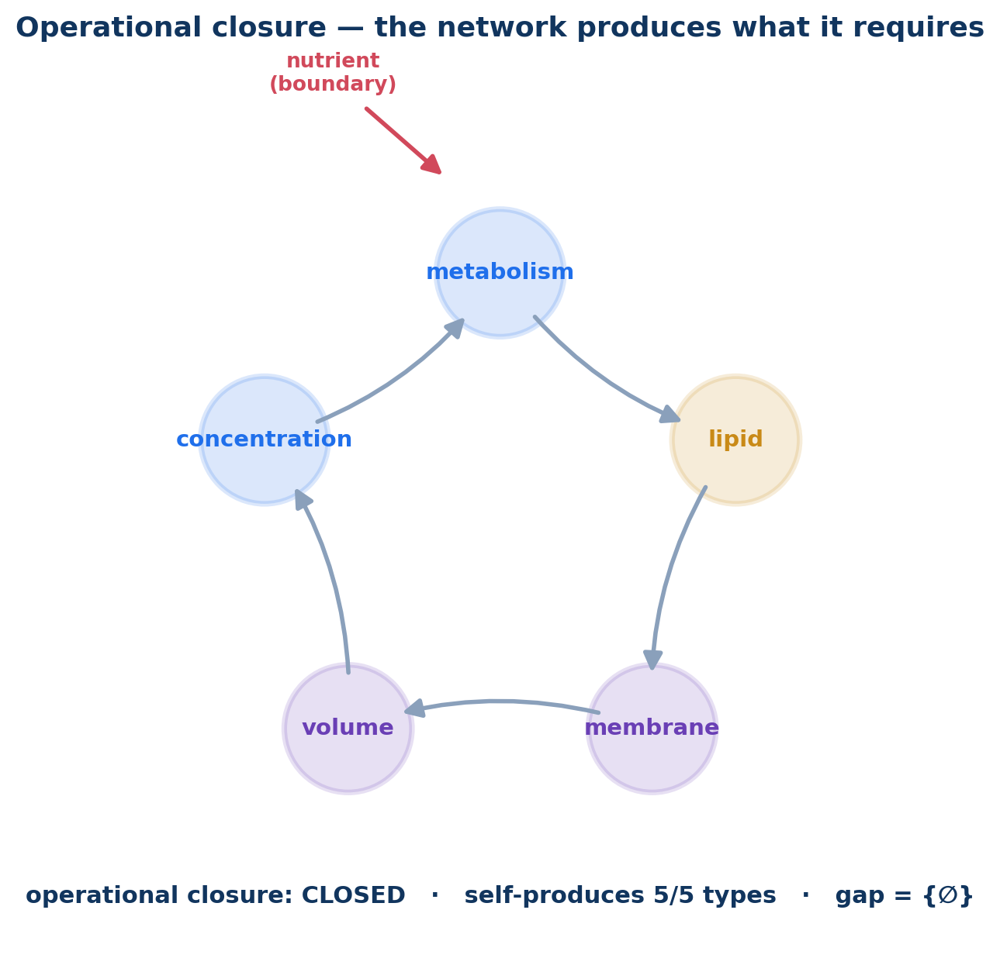

# pbg-autopoiesis

**A whole-cell model built as a precarious, self-bounding network — assembled increment by increment from composable parts, and measured by how much of itself it produces.**

This is not a model of a cell *in* a container. It is an attempt to compose a cell that **produces its own container** — the persistence of a precarious identity that emerges, bottom-up, from the molecular domain.

---

## The thesis: autopoiesis = operational closure

An **autopoietic** system is a network of processes that produces the very components that produce the network. A cell makes the membrane that contains the metabolism that synthesizes the membrane. Its identity is:

- **Precarious** — far from equilibrium; it would dissipate without continuous self-production. It persists only as a *process*, the way a standing wave persists while the water moves through it.
- **Self-produced** — the boundary that individuates it (makes it a *unity*, distinct from its environment) is not imposed; it is a product of the molecular processes themselves.
- **Operationally closed** — every component-type the network requires is produced *by* the network. Only nutrients and energy cross the boundary.

In composition terms, operational closure is a computable condition over a typed component catalog:

```
autopoietic_gap(S) = requires(S) \ provides(S) \ boundary
```

For a composed set of processes `S`, the gap is everything the network needs but cannot make itself, minus what we declare as environmental input. **The system is operationally closed — a cell — when that gap is empty.** Building a whole cell = driving the gap set down to `{nutrients, energy}`, one increment at a time. The catalog is not just an inventory; it is an **autopoiesis meter** (`pbg_autopoiesis/meter.py`).

## The crux: the membrane is the part the library is missing

The existing whole-cell-modeling parts (v2ecoli and its lineage) give us the **interior** — metabolism, expression, replication — but model the boundary as a *given*: fixed compartment labels and a volume *derived from mass*. There is lipid **metabolism**, but no membrane **process**, nothing whose output *is* the boundary, and nothing where the boundary constrains the interior. Their identity is supplied by the simulation, not produced by the cell.

So you cannot compose autopoiesis out of those parts alone — **the single most essential part, the self-producing membrane, is absent.** That absence is the center of this project. The work is to build the **membrane/metabolism co-construction** the library lacks, and grow the interior inside it.

## The minimal autopoietic loop

```
   metabolism ──makes──▶ lipids ──grow──▶ membrane  (the boundary)
       ▲                                      │
       │                                   derives
   concentration ◀──sets── volume V ◀────────┘
```

The membrane grows by consuming the lipids metabolism makes; the membrane *derives the volume* (the boundary emerges — `volume = geometry(membrane lipids)`, never declared); the volume sets the **count↔concentration** mapping; concentration drives the metabolism that makes the lipids. **Volume is the coupling variable** — which is why the count↔concentration adapter (see `docs/` design specs) is the literal hinge of the loop, not a convenience.

And the loop is **precarious by construction**: the membrane decays without replenishment. Feed the network and the boundary persists through complete material turnover; starve it and the identity dissipates. *"Does the cell fall apart when you stop feeding it?"* is the acceptance test — and a far better one than "does it produce ATP."

## Increment roadmap (boundary shrinks inward)

| # | Increment | Moves from imported → self-produced | Boundary after |
|---|---|---|---|
| **1** | **Minimal membrane/metabolism loop** *(this commit)* | the boundary itself (volume, membrane) | `{nutrient, energy}` |
| 2 | Real metabolism (compose v2ecoli FBA) | building blocks (precursors) | `{glucose, ions, energy}` |
| 3 | Expression machinery | the enzymes/machinery (made, not given) | `{glucose, ions, energy}` |
| 4 | Replication / division | the genome copy → reproduction | operational closure |

Each increment reports its **closure metric**: `self-produces N of M required component-types; boundary = {…}`. The whole-cell model is *done* when the meter reads closed.

## Status

**Increment 1 — in progress.** A clean, runnable process-bigraph composite of the minimal loop: a toy metabolism (`nutrient → precursor → lipid`), a membrane that grows by incorporating lipids and decays without them, and an emergent volume that couples back into metabolic concentrations. Establishes the architecture, the autopoiesis meter, and the precariousness test. Later increments replace the toy interior with real v2ecoli parts.

> The toy metabolism and an inline count↔concentration conversion are scaffolding for increment 1 — placeholders for the real v2ecoli FBA and the typed `ConversionAdapter`. What is *real* in increment 1 is the **loop structure**: self-produced boundary, volume coupling, operational-closure meter, and observable precariousness.

## Layout

```
pbg_autopoiesis/
  processes.py   # Supply, Metabolism, Membrane (Process) + Boundary (Step, derives volume)
  loop.py        # builds the membrane/metabolism composite; fed-vs-starved runner
  meter.py       # the autopoiesis meter — operational-closure / gap over process interfaces
tests/
  test_loop.py   # builds + runs; fed→persists, starved→decays (precariousness); meter→closed-mod-nutrient
docs/            # the design specs this is grown from (adapters; type-directed composition)
```

Run the demo: `python -m pbg_autopoiesis.loop`  ·  Tests: `pytest -q`  ·
Visual gallery: `python -m pbg_autopoiesis.viz` → `figures/index.html`

## This is an investigation

The build-up is structured as a **multipart investigation driven by the biological schema
framework** — each increment is a *study*, the autopoiesis meter is its *acceptance
criterion*, precariousness is its *behavior test*, and the figures are its *evidence*. See
[`docs/investigation.md`](docs/investigation.md). Study 1 (this commit) **passes**: operational
closure CLOSED, the identity precarious-but-maintained.


